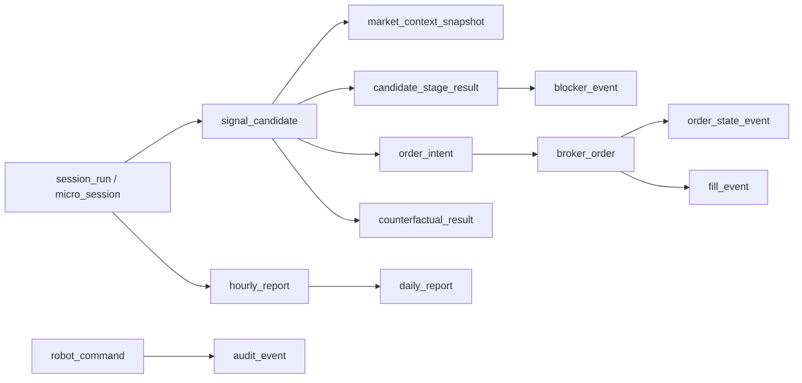

# Schema для глубокой торговой аналитики

Документ фиксирует PostgreSQL-схему бизнес-фактов для отчетов, калибровки стратегии и counterfactual analysis. Это не raw technical logs: stdout/stderr контейнеров остаются в контуре Fluent Bit -> Loki, а в Postgres попадают доменные факты, состояния и агрегаты.

## Основной путь данных

`candidate_id` является центральным join key для разбора пути:

`signal_candidate -> candidate_stage_result -> blocker_event -> order_intent -> broker_order -> order_state_event/fill_event -> counterfactual_result`.

Для брокерского idempotency и reconciliation отдельно хранятся `request_order_id`, `exchange_order_id` и `tracking_id`. Они не заменяют `candidate_id`, а дополняют его там, где кандидат уже перешел в ордерный lifecycle.

## Сущности

| Таблица | Назначение |
| --- | --- |
| `session_run` | Существующий логический запуск торговой сессии/подсессии без рестарта `trade-core`. |
| `micro_session` | Отдельная hourly micro-session как аналитический объект: статус, freeze/close time, snapshot rollover. |
| `market_context_snapshot` | Feature snapshot рынка около кандидата, блокера или отчета: цены, spread, depth, imbalance, freshness. Для blocked opportunity дополнительно пишется `snapshot_kind=counterfactual_seed_snapshot`. |
| `signal_candidate` | Потенциальная сделка до прохождения risk/execution gates. |
| `candidate_stage_result` | Decision journal по стадиям кандидата: `stage_seq`, `stage_name`, `stage_outcome`, метрики и пороги. |
| `blocker_event` | Итоговые и промежуточные блокеры с `blocker_code`, `blocker_family`, measured/threshold values. |
| `order_intent` | Внутреннее идемпотентное намерение разместить/отменить/заменить заявку. |
| `broker_order` | Нормализованное состояние заявки по данным брокера. |
| `order_state_event` | Append-only история смены состояния заявки, включая cancel/reject reason codes. |
| `fill_event` | Исполнения с комиссиями, slippage и PnL-полями. |
| `position_snapshot` | Снимки позиции на границах micro-session и risk-событиях. |
| `risk_event` | Решения risk engine и наблюдения лимитов. |
| `counterfactual_result` | Что было бы с заблокированным/отмененным кандидатом через 5/10/15 минут. |
| `hourly_report` | Агрегат закрытой micro-session. |
| `daily_report` | Дневной агрегат по session/instrument/timeframe. |
| `robot_command` | Durable команды оператора: `start`, `stop`, `pause`, `resume`, `emergency_stop` и их lifecycle. |
| `report_job_outbox` | Transactional outbox для постановки тяжелых отчетов в `report-worker`. |
| `audit_event` | Аудит операторских и системных действий. |

## Partitioning

High-volume таблицы partitioned по `trading_date`:

- `blocker_event`
- `candidate_stage_result`
- `market_context_snapshot`
- `order_state_event`
- `fill_event`
- `audit_event`
- `strategy_state_event`
- `counterfactual_result`
- `market_candle`
- `market_status_snapshot`
- `order_book_summary`

Для новых partitioned таблиц миграция создает default partition в PostgreSQL, чтобы локальная разработка и controlled launch не падали при отсутствии заранее созданной дневной партиции. Дальше можно добавить runbook/задачу, которая создает партиции по календарю торгов.

## JSONB payloads

JSONB используется только для расширяемого контекста:

- `feature_snapshot`
- `explanation_payload`
- `signal_payload`
- `reason_payload`
- `intent_payload`
- `broker_payload`
- `state_payload`
- `fill_payload`
- `risk_payload`
- `result_payload`
- `report_payload`
- `audit_payload`

Аналитически важные поля вынесены в отдельные колонки: `stage_seq`, `stage_name`, `stage_outcome`, `blocker_code`, `blocker_family`, `measured_value`, `threshold_value`, `commission_gross`, `commission_net`, `slippage_bp`, `pnl_gross`, `pnl_net`.

## Индексы

Быстрые фильтры для UI и отчетов:

- `instrument_id + timeframe + trading_date + session_type` на candidate/stage/blocker/order/fill/counterfactual срезах.
- `candidate_id` на decision journey таблицах.
- `blocker_code` на `blocker_event` и `candidate_stage_result`.
- `request_order_id`, `exchange_order_id`, `tracking_id` на ордерном lifecycle.

## Repository helpers

`trading_common.db.repositories` содержит use-case helpers:

- `MicroSessionRepository` для создания/закрытия hourly micro-session.
- `MarketContextSnapshotRepository` для feature snapshots.
- `CandidateStageResultRepository` для decision journal.
- `OrderRepository.create_order_state_event()` и `OrderRepository.list_order_state_events()`.
- `AnalyticsReadRepository.get_candidate_journey()` для UI/отчетов.
- `AnalyticsReadRepository.blocker_ranking()` для ranking блокеров.
- `AnalyticsReadRepository.recent_candidates()`, `list_hourly_reports()`, `list_daily_reports()`.

## Open questions / TODO

- Добавить автоматическое создание дневных партиций до старта торгового дня.
- Зафиксировать retention policy для high-volume snapshots.
- После появления реальной стратегии расширить `candidate_stage_result.stage_name` контролируемым enum/registry.
- Добавить materialized views для тяжелых отчетных витрин, когда появится реальный объем данных.
