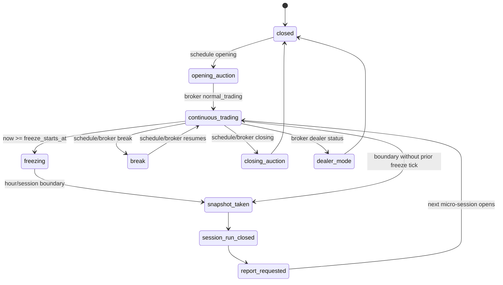

# Session Manager и hourly micro-sessions

Этот документ фиксирует реализацию шага 05. Он дополняет `Docs/architecture.md`,
`Docs/logging-analytics-spec.md` и `Docs/adr/ADR-005-hourly-micro-sessions.md`.

## Цель

`trade-core` остается долгоживущим процессом. Смена часа, утренней, основной,
вечерней или выходной сессии обрабатывается логически внутри процесса через
`SessionManager` и `HourlyMicroSessionManager`.

Главные гарантии:

- `trade-core` не перезапускается физически каждый час;
- `TradingSchedules` задает плановую биржевую сетку;
- `GetTradingStatus` или `Info` stream задает фактический broker status;
- `calendar_date` и `trading_date` хранятся раздельно;
- `session_run` фиксирует каждую logical micro-session;
- `strategy_state_event` фиксирует transitions: open, freeze, snapshot, close, report request;
- `report_requested` создается сразу после закрытия micro-session и должен забираться
  `report-worker`.

## State Machine

## SessionManager

`SessionManager.evaluate()` принимает:

- `now` - биржевое время наблюдения;
- `TradingSchedule` - заранее полученные окна из `TradingSchedules`;
- `BrokerTradingStatus` - текущий статус из `GetTradingStatus` или `Info` stream.

Результат - `SessionSnapshot` для API/UI, order gates и micro-session manager.

Поля snapshot:

- `observed_at`;
- `calendar_date`;
- `trading_date`;
- `session_type`: `weekend`, `weekday_morning`, `weekday_main`, `weekday_evening`;
- `session_phase`: `opening_auction`, `continuous_trading`, `closing_auction`,
  `break`, `dealer_mode`, `closed`;
- `broker_phase`;
- `broker_trading_status`;
- `broker_api_trade_available`;
- `schedule_phase`;
- `schedule_window_start_at`;
- `schedule_window_end_at`;
- `micro_session_id`;
- `is_trading_allowed`;
- `deny_reason_code`;
- `status_mismatch`;
- `source`.

Если расписание и broker status расходятся, `status_mismatch=true`, а новые входы
запрещаются до нормализации статуса.

## HourlyMicroSessionManager

Micro-session открывается только когда `session_phase=continuous_trading` и
`is_trading_allowed=true`.

Границы:

- `planned_start_at` - начало часового bucket или начало биржевого окна;
- `planned_end_at` - следующий час или конец биржевого окна, что наступит раньше;
- `freeze_starts_at` - `planned_end_at - freeze_seconds`;
- `freeze_seconds` допускается только в диапазоне 60-90 секунд.

На rollover:

1. фиксируется `snapshot_taken`;
2. закрывается старый `session_run`;
3. пишется `session_run_closed`;
4. пишется `report_requested`;
5. если новая сессия уже в `continuous_trading`, сразу открывается новая micro-session.

Если робот стартует в середине часа, например в `07:30`, micro-session все равно
закрывается на часовой границе `08:00`, а не через час после запуска процесса.

Если старая micro-session закрывается на границе `weekday_morning -> weekday_main`
или `weekday_main -> weekday_evening`, события закрытия старой micro-session
сохраняют старый `session_type`. Это не смешивает утренние, основные и вечерние
данные в отчетах и калибровке.

## Order Policy

`OrderSessionPolicy` возвращает `OrderPermission`.

Базовые правила:

- `continuous_trading`: разрешены `entry`, `exit`, `cancel`, `replace`;
- `opening_auction`: разрешен только `cancel`;
- `closing_auction`: разрешены `exit` и `cancel`;
- `break`: разрешен только `cancel`;
- `dealer_mode` и `closed`: действия запрещены.

Канонические reason codes:

- `session_forbidden`;
- `phase_forbidden`;
- `order_type_forbidden`;
- `weekend_broker_mode`.

## Persistence

Используем существующую схему БД:

- `session_run` - lifecycle logical micro-session;
- `strategy_state_event` - append-only transitions и snapshot payload.

Новые миграции на этом шаге не нужны, потому что таблицы и поля были добавлены
на шаге 03.

## Покрытые edge cases

- переход `weekday_morning -> weekday_main`;
- переход `weekday_main -> weekday_evening` через break;
- weekend с отдельными `calendar_date` и `trading_date`;
- dealer mode на выходной с `weekend_broker_mode`;
- rollover внутри биржевой сессии;
- freeze перед часовой границей;
- закрытие и немедленное открытие новой micro-session без restart;
- auction/break boundaries без открытия micro-session;
- mismatch между `TradingSchedules` и broker status.
